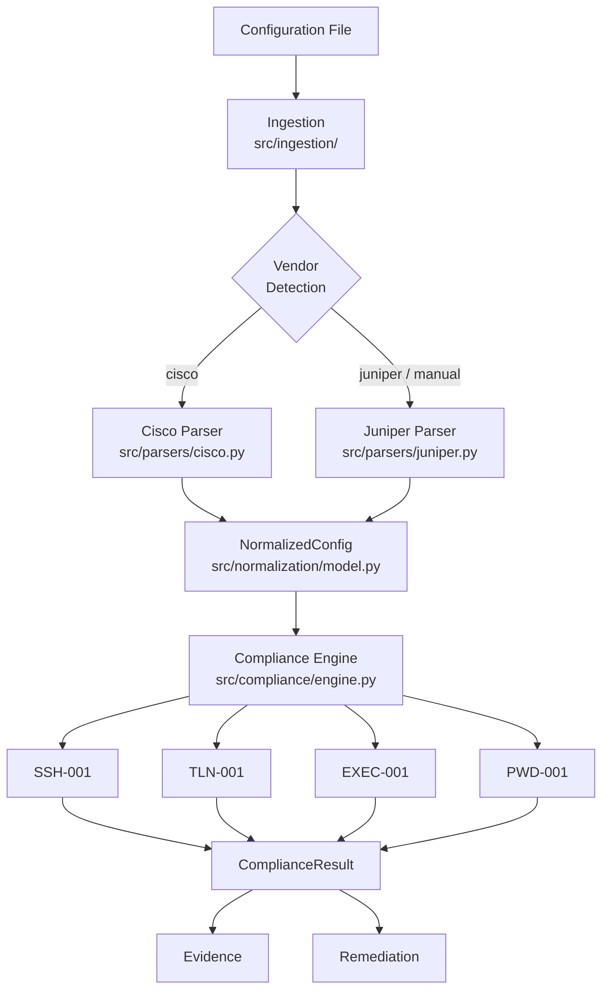

# PS 26155 — Architecture Reference

## Overview

PS 26155 implements a **deterministic, evidence-backed network device security compliance auditor**. It accepts plain-text configuration files from network devices, parses them into a vendor-neutral model, and evaluates that model against security compliance rules.

The architecture separates vendor-specific concerns (parsing) from vendor-neutral concerns (compliance evaluation) through a shared normalization model (`NormalizedConfig`). Compliance rules never import vendor parsers.

---

## Full Pipeline



---

## Module Map

| Module | File | Responsibility |
|---|---|---|
| **Ingestion** | `src/ingestion/loader.py` | Accept file path, validate, return UTF-8 text |
| **Vendor Detection** | `src/ingestion/detector.py` | Inspect raw text → `"cisco"`, `"juniper"`, or `"unknown"` |
| **Cisco Parser** | `src/parsers/cisco.py` | Parse Cisco IOS text → `NormalizedConfig` |
| **Juniper Parser** | `src/parsers/juniper.py` | Parse JunOS text → `NormalizedConfig` |
| **Normalization Model** | `src/normalization/model.py` | `NormalizedConfig`, `ConfigSection`, `ConfigItem` |
| **Compliance Engine** | `src/compliance/engine.py` | `audit(config, rules)` → `list[ComplianceResult]` with per-rule exception isolation |
| **Rule Registry** | `src/compliance/registry.py` | `RULE_REGISTRY` — pre-instantiated list of all active rules |
| **Compliance Model** | `src/compliance/model.py` | `ComplianceResult`, `Evidence`, `Remediation`, `Severity`, `ComplianceStatus` |
| **Rule Base** | `src/compliance/rules/base.py` | `SecurityControl` (metadata), `ComplianceRule` (abstract evaluator) |
| **SSH-001** | `src/compliance/rules/ssh_version.py` | SSH protocol version check |
| **TLN-001** | `src/compliance/rules/telnet_disabled.py` | Telnet disabled check |
| **EXEC-001** | `src/compliance/rules/exec_timeout.py` | VTY idle session timeout check |
| **PWD-001** | `src/compliance/rules/pwd_encryption.py` | Privileged password hashing check |
| **AAA-001** | `src/compliance/rules/aaa.py` | Remote AAA authentication primacy check |

---

## Normalization Model

The `NormalizedConfig` is the strict boundary between vendor-specific parsers and vendor-neutral rules.

```python
@dataclass
class ConfigItem:
    key: str          # directive name (e.g. "ip", "transport", "exec-timeout")
    value: str | None # directive value (e.g. "ssh version 2"), or None for flags
    raw_line: str     # original unmodified source line

@dataclass
class ConfigSection:
    name: str                   # e.g. "line vty 0 4", "system"
    items: list[ConfigItem]
    metadata: dict[str, Any]    # advisory only — not used for compliance decisions

@dataclass
class NormalizedConfig:
    vendor: str                    # "cisco" | "juniper"
    hostname: str | None
    sections: list[ConfigSection]  # top-level blocks
    global_items: list[ConfigItem] # directives outside any block
    raw_config: str                # original text for traceability
    source_file: str | None        # path to source file; None when parsed from a string
```

---

## Cisco Parser Behaviour

The Cisco IOS / IOS-XE parser (`src/parsers/cisco.py`) processes indentation-based stanza syntax:

- **Section starters** (`interface`, `line`, `router`, `ip vrf`, `vlan`, `crypto`, `policy-map`, `class-map`, `route-map`, `control-plane`, `banner`) open a new `ConfigSection`.
- **Indented lines** are `ConfigItem` entries belonging to the current section.
- **Non-indented, non-stanza lines** become `global_items`.
- **`!` and blank lines** close the current section.
- **`end`** closes the current section.

**Key parsing detail:** `ip ssh version 2` is tokenised as `key="ip"`, `value="ssh version 2"`. Multiple `ip ...` directives share the same key. Rules must scan all `global_items` and filter by value prefix, not use `get_global("ip")` alone.

---

## Juniper Parser Behaviour

The Juniper JunOS parser (`src/parsers/juniper.py`) processes brace-delimited hierarchical syntax using a **depth counter**:

- **Depth 0:** global scope
- **Depth 1:** top-level block (current `ConfigSection`)
- **Depth ≥ 2:** nested blocks — items are captured under the enclosing top-level section

This means `system { services { ssh { protocol-version v2; } } }` produces:

```
section.name = "system"
item.key     = "protocol-version"
item.value   = "v2"
```

Comment stripping: lines starting with `#` or `##` are skipped.

### Known Limitation: Juniper Path Flattening

All items at depth ≥ 2 are attached to the enclosing **top-level** section without preserving
the intermediate block hierarchy. For example:

```
system { services { ssh { protocol-version v2; } telnet; } }
```

Produces `system.items = [ConfigItem(key="protocol-version", ...), ConfigItem(key="telnet", ...)]`.

The `protocol-version` item has **no path information** indicating it came from the `ssh` sub-block.
Rules must rely on the uniqueness of key names across sibling blocks. This is an accepted trade-off
for the current implementation; path tracking is deferred to a future version.

---

## Compliance Engine

The engine evaluates each rule in isolation with exception protection:

```python
def audit(config: NormalizedConfig, rules: list[ComplianceRule]) -> list[ComplianceResult]:
    results = []
    for rule in rules:
        try:
            results.append(rule.evaluate(config))
        except Exception:
            results.append(<NEEDS_REVIEW result with traceback in evidence>)
    return results
```

- **One result per rule**, in the same order as `rules`. Results are never omitted.
- **Exception isolation:** a crashing rule produces a `NEEDS_REVIEW` result with the full
  traceback in `evidence[0].note`. Other rules in the list continue to run.
- The engine has no awareness of individual rules or vendors.
- All vendor-specific extraction logic lives inside each `ComplianceRule` subclass.

### Rule Registry

Use `RULE_REGISTRY` from `src.compliance.registry` to run all active rules:

```python
from src.compliance.registry import RULE_REGISTRY
from src.compliance.engine import audit

results = audit(config, RULE_REGISTRY)
```

To add a new rule: implement the class → add one instance to `RULE_REGISTRY` → add tests.

---

## ComplianceRule Contract

Every rule must:

1. Define a class-level `control: SecurityControl` with static metadata.
2. Implement `evaluate(config: NormalizedConfig) -> ComplianceResult`.
3. Call `self._not_applicable(config)` first if vendor is not applicable.
4. Return the same output for the same input (deterministic).
5. Never import or reference vendor parsers.
6. Never perform regex/string parsing on `ConfigItem.raw_line` — use `ConfigItem.value`.

---

## Compliance Result States

| Status | Meaning |
|---|---|
| `PASS` | Configuration satisfies the control requirement |
| `FAIL` | Configuration violates the control requirement |
| `NOT_APPLICABLE` | Control does not apply to this vendor — not a finding |
| `NEEDS_REVIEW` | Value is ambiguous or unrecognised — manual inspection required |

---

## Evidence Architecture

Every `ComplianceResult` contains one or more `Evidence` records, regardless of status.

```python
@dataclass(frozen=True)
class Evidence:
    control_id: str
    section_name: str | None    # None for global items
    raw_lines: tuple[str, ...]  # empty tuple = absence evidence (directive not found)
    observed: str | None        # the value the rule found
    expected: str | None        # the value/condition required
    note: str                   # mandatory human-readable explanation
```

**Absence evidence** (`raw_lines=()`, `observed=None`) is used when the relevant directive was not found. This is distinct from "directive found with bad value".

---

## Remediation Architecture

```python
@dataclass(frozen=True)
class Remediation:
    vendor: str         # "cisco", "juniper", or "any"
    guidance: str       # plain-English corrective instructions
    config_hint: str | None  # example config snippet — advisory only, never auto-applied
```

- Populated only for `FAIL` results.
- Vendor-specific — a Cisco FAIL only returns a Cisco remediation.
- `config_hint` must never be applied automatically.

---

## Multi-Section VTY Evaluation (TLN-001, EXEC-001)

Cisco devices can have multiple `line vty` ranges. Rules that evaluate VTY sections use **worst-case aggregation**:

```
Any section FAIL          → overall FAIL
No FAIL, any NEEDS_REVIEW → overall NEEDS_REVIEW
All sections PASS         → overall PASS
```

Evidence is collected per-section.

---

## NOT_APPLICABLE Handling

- Returns one evidence record explaining why the control does not apply.
- The result is not a finding and must not be treated as a compliance failure.
- Allows a fixed rule set to safely run across heterogeneous device inventories.

---

## Key Architectural Decisions

| Decision | Rationale |
|---|---|
| Parsers output `NormalizedConfig`, not vendor types | Rules stay vendor-neutral; new vendors only require a new parser |
| Rules must not import parsers | Prevents vendor syntax leaking into the compliance layer |
| Compliance is deterministic (no AI/LLM) | Reproducibility, auditability, debuggability |
| Evidence is mandatory for all statuses including PASS | Auditors must verify *why* a device passed |
| `NOT_APPLICABLE` is a valid result (not an error) | Safe operation across heterogeneous inventories |
| `Remediation.config_hint` is advisory only | Prevents accidental automated config changes |
| Juniper parser uses brace-depth counter | Avoids recursion issues on deeply nested configs |
| Engine uses per-rule exception isolation | One broken rule cannot abort the entire scan |
| `NormalizedConfig.source_file` is optional (default `None`) | Backward compatible; enables finding traceability when a file path is known |
| Juniper path flattening is a documented trade-off | Adds path tracking is deferred; current rules work via key-name uniqueness |

---

## Limitations (Current Version)

| Limitation | Impact | Deferred To |
|---|---|---|
| Juniper nested blocks have no path tracking | Rules rely on key uniqueness across sibling blocks | Future version |
| Cisco `ip X Y Z` → `key="ip"` | Rules must use `value.startswith()` heuristics | Future version |
| No line numbers in evidence | Frontend cannot link a finding to an exact line | Future version |
| `detect_vendor()` uses first-match | Ambiguous configs resolve to the first vendor matched | Acceptable |
| Juniper detection markers are a finite set | Unusual JunOS-only configs may not be detected | Extend markers if needed |
