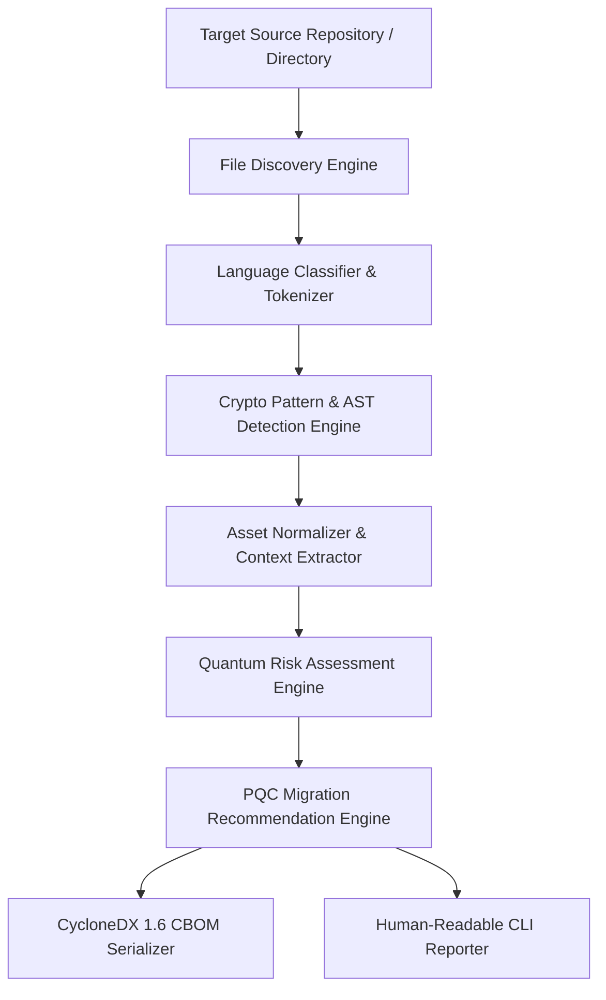

# Enterprise Cryptographic Discovery & Analysis Tool (ECDAT)
## Day 1: System Architecture & Tech Stack (PS 26164)

---

### 1. High-Level System Architecture

The ECDAT system follows a clean modular pipeline:

---

### 2. Pipeline Component Breakdown

| Component | Responsibility | Tech / Module |
| :--- | :--- | :--- |
| **File Discovery Engine** | Recursively traverses directory trees, respects `.gitignore`, filters supported extensions (`.py`, `.java`, `.c`, `.cpp`, `.h`). | Python `pathlib`, `fnmatch` |
| **Detection Engine** | Dual-mode parsing: Fast regex matching for pattern signatures + AST (Abstract Syntax Tree) parsing for structural analysis. | Python `ast`, `re` |
| **Asset Normalizer** | Converts raw detection matches into uniform ECDAT Cryptographic Asset objects. | Pydantic / Python dataclasses |
| **Quantum Risk Engine** | Evaluates algorithm susceptibility against Shor's & Grover's algorithms based on key sizes and parameters. | Deterministic Risk Matrix Rulebook |
| **PQC Recommendation Engine** | Maps vulnerable/legacy assets to NIST PQC standard equivalents (FIPS 203/204/205). | Deterministic PQC Mapping Table |
| **CBOM & Report Serializer** | Formats normalized assets into CycloneDX 1.6 JSON format and formatted CLI tables. | Python `json`, `rich` |

---

### 3. Tech Stack Selection & Justification

* **Primary Language**: **Python 3.11+**
  * *Why*: Standard library includes built-in AST capabilities (`ast` module), powerful regular expressions, cross-platform file system APIs, and rapid prototyping without complex toolchain dependencies.
* **Data Validation**: **Pydantic v2** (or standard library `dataclasses` if zero third-party deps required)
  * *Why*: Guarantees strict type validation and effortless JSON serialization matching the CycloneDX schema.
* **CLI Output Formatting**: **Rich**
  * *Why*: Provides clean, color-coded terminal tables, progress bars, and risk highlights for competition demos.
* **Testing Framework**: **pytest**
  * *Why*: Standard, robust unit testing framework for verifying detection rule accuracy against sample code files.

---

### 4. Architectural Guiding Rules (Aligned with Team Leadership)

1. **Deterministic Logic Over LLMs**: Cryptographic asset identification, risk scoring, and PQC recommendations must be 100% deterministic and rule-backed. LLMs are NOT used for security classification.
2. **Modular File Structure**: Keep detection rules separated by language (`rules_python.py`, `rules_java.py`, `rules_c.py`).
3. **No Hardcoded State**: Configurable detection patterns and risk tables stored in clean Python data modules or JSON configurations.
